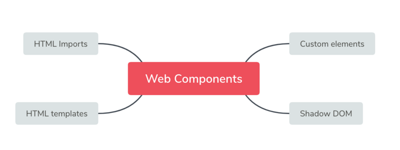

# Web Components 浏览器原生组件

## 1、Web Components是什么

> Web Components技术可以把一组相关的HTML、JS代码和CSS风格打包成为一个自包含的组件,直接当成普通的标签使用。由浏览器提供底层的支持，不依赖各种框架的支持和webpack的编译

组件是前端的发展方向，现在流行的 React 和 Vue 都是组件框架。谷歌公司由于掌握了 Chrome 浏览器，一直在推动浏览器的原生组件，即 Web Components API。相比第三方框架，原生组件简单直接，符合直觉，不用加载任何外部模块，代码量小。


## 2、Web Components组成

> Web Components由以下四个部分组成：




## 3、HTML templates

```html
<body>
  <!-- 
    这种自定义的 HTML 标签，称为自定义元素（custom element）。根据规范，自定义元素的名称必须包含连词线，用与区别原生的 HTML 元素。所以，<user-card>不能写成<usercard>
  -->
  <user-card></user-card>

  <template id="userCardTemplate">
      <!-- 组件的样式应该与代码封装在一起，只对自定义元素生效，不影响外部的全局样式。所以，可以把样式写在<template>里面 -->
    <style>
      /* <template>样式里面的:host伪类，指代自定义元素本身 */
      :host {
        display: flex;
        align-items: center;
        width: 450px;
        height: 180px;
        background-color: #d4d4d4;
        border: 1px solid #d5d5d5;
        box-shadow: 1px 1px 5px rgba(0, 0, 0, 0.1);
        border-radius: 3px;
        overflow: hidden;
        padding: 10px;
        box-sizing: border-box;
        font-family: 'Poppins', sans-serif;
      }
      .image {
        flex: 0 0 auto;
        width: 160px;
        height: 160px;
        vertical-align: middle;
        border-radius: 5px;
      }
    </style>

    
    <div class="container">
      <p class="name">User Name</p>
      <p class="email">yourmail@some-email.com</p>
      <button class="button">Follow</button>
    </div>
  </template>
</body>

```
```js
// 自定义标签也是标签，需要继承标签的基本类 HTMLElement， 因此继承了 HTML 元素的特性
class UserCard extends HTMLElement {
  constructor() {
    super()

    var templateElem = document.getElementById('userCardTemplate');
    var content = templateElem.content.cloneNode(true);
    this.appendChild(content);
  }
}
// 使用浏览器原生的customElements.define()方法，告诉浏览器<user-card>元素与这个类关联
// 即全局注册该元素
window.customElements.define('user-card', UserCard);
```

## 4、Shadow DOM
> 我们不希望用户能够看到<font color=red>`<user-card>`</font>的内部代码，Web Component 允许内部代码隐藏起来，这叫做 Shadow DOM，即这部分 DOM 默认与外部 DOM 隔离，内部任何代码都无法影响外部,自定义元素的<font color=red>`this.attachShadow()`</font>方法开启 Shadow DOM

- 内部DOM Tree不会被外部文档访问到
- 也不会被外部的风格设置影响
- 内部的风格也不会影响到外部文档

```js
class UserCard extends HTMLElement {
  constructor() {
    super()
    // 自定义元素的this.attachShadow()方法开启 Shadow DOM
    var shadow = this.attachShadow( { mode: 'closed' } );

    var templateElem = document.getElementById('userCardTemplate');
    var content = templateElem.content.cloneNode(true);
    shadow.appendChild(content);
  }
}
```

## HTML Imports <font color=red>(好像被移除了)</font>

<a href="./3.html">查看</a>