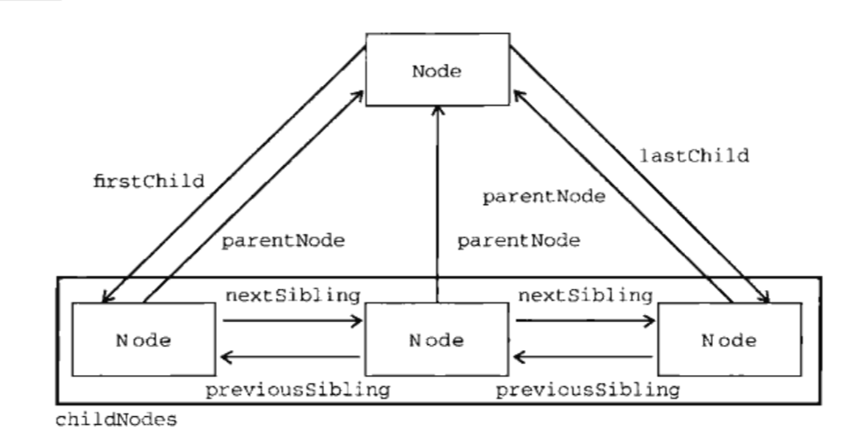

## DOM 文档对象模型

> Document Object Model --- DOM

### 1、Node类型

> 所有的节点都继承自Node类型，因此所有的节点都具有Node类型的所有属性和方法

```js
$('div') instanceof Node // true
$('span') instanceof Node // true
$('html') instanceof Node // true
```

#### a、nodeType节点属性
> 通过nodeType可以确定一个节点属于那一个类型的节点
```js
// 元素节点
$('html').nodeType // 1
// 获取属性节点
$('html').attributes[0].nodeType // 2
// 文本节点
$('html').childNodes[1].nodeType // 3
```

#### b、节点关系
> 每个节点都保存一个childNodes属性，其中保存着一个<font color=red>NodeList</font>对象

```js
$('html').childNodes instanceof NodeList // true
$('div').childNodes instanceof NodeList // true
```



