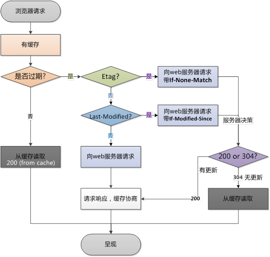

# 浏览器缓存

<a href="https://segmentfault.com/a/1190000021060741">彻底理解浏览器缓存机制</a>

### 1、响应头缓存字段

- `Expires` http/1.0 字段
- `Cache-Control` http/1.1 字段

> 注意： 响应头中同时存在这两个字段时，只有`Cache-Control`生效

### 2、Cache-Control

- `public` 客户端、代理服务器都可以缓存
- `private` 客户端可以缓存（默认值）
- `no-cache` 客户端可以缓存，但是需要走协商缓存
- `no-store` 内容不会被缓存
- `max-age=xxx` 缓存将在xxx秒后失效

### 3、协商缓存的标识

- `Last-Modified / If-Modified-Since` --- 该资源文件在服务器最后被修改的时间
- `Etag / If-None-Match`（优先级高） --- 当前资源文件的一个唯一标识(由服务器生成)

### 4、总结

> 强制缓存优先于协商缓存进行，若强制缓存 `Expires` 和 `Cache-Control` 生效则直接使用缓存，若不生效则进行协商缓存（`Last-Modified / If-Modified-Since`和 `Etag / If-None-Match`）

