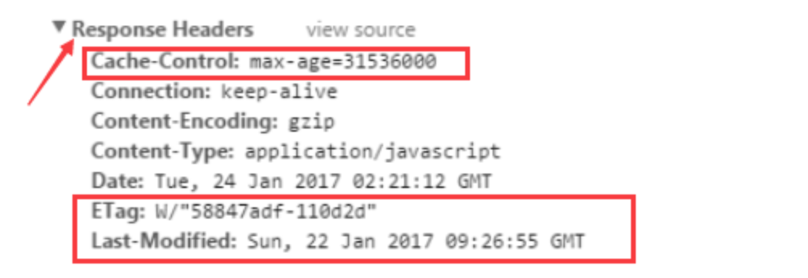
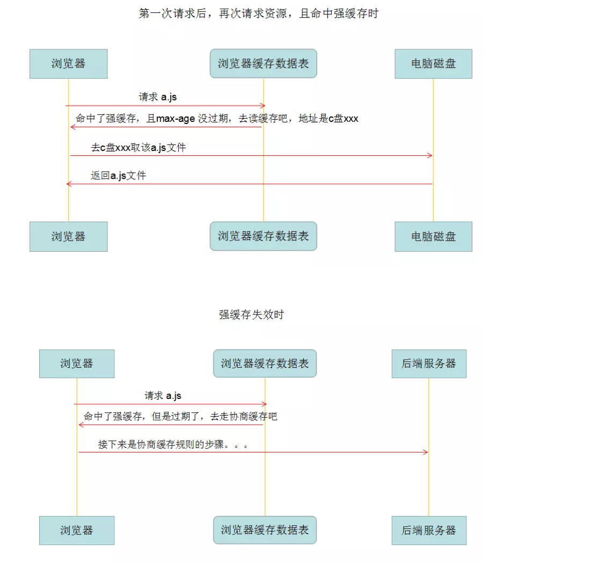
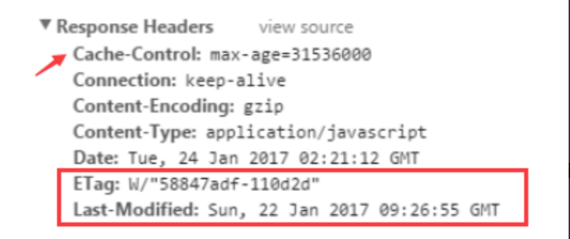
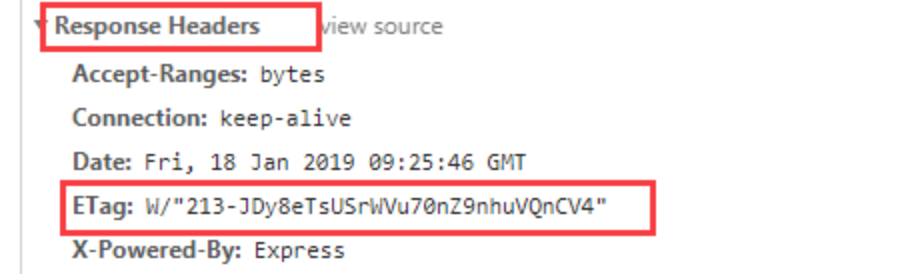
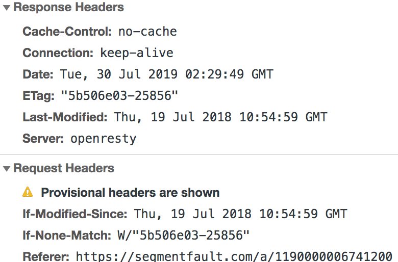
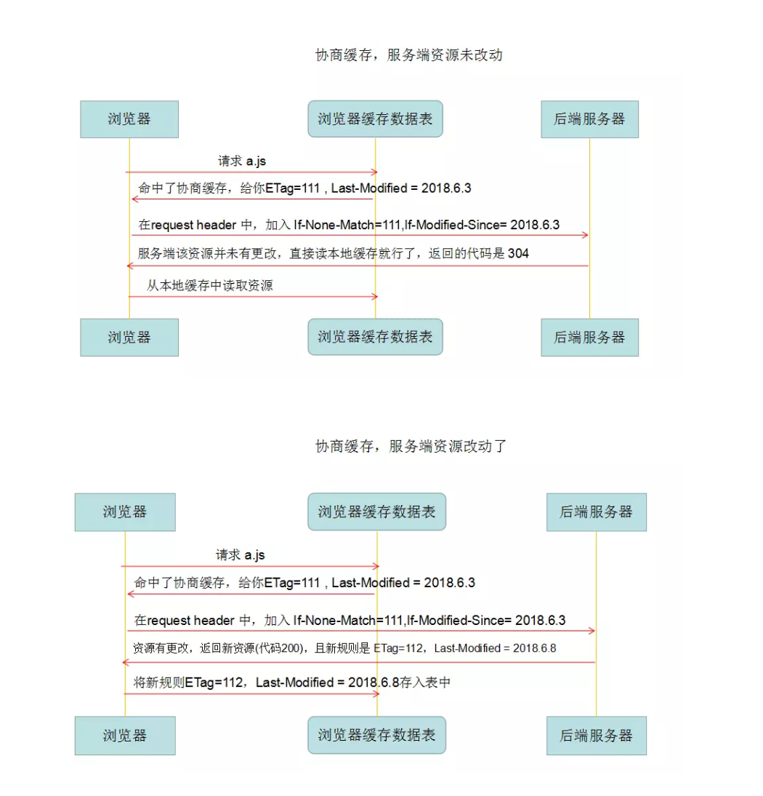
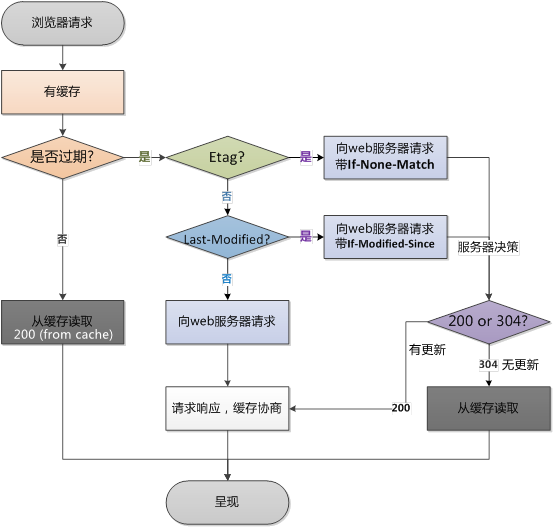
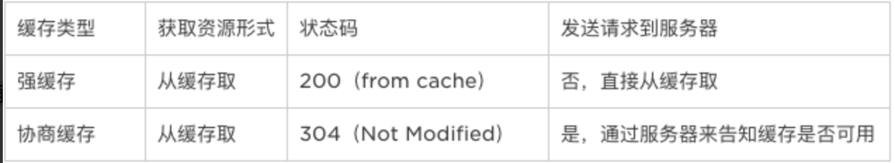

### 缓存

<a href="https://juejin.im/post/5c417993f265da61285a6075">前端之浏览器缓存，一次搞定</a>
<a href="https://segmentfault.com/a/1190000006741200">详解web缓存</a>

#### 1、为什么要用缓存

> 一般针对静态资源如CSS,JS,图片等使用缓存

+ **节省带宽**：对于已缓存的文件，可以减少请求带宽甚至无需请求网络
+ **降低服务器压力**：在大量用户并发请求的情况下，服务器的性能受到限制，此时将一些静态资源放置在网络的多个节点，可以起到均衡负载的作用，降低服务器的压力。
+ **请求更快**：通过将内容缓存在本地浏览器或距离最近的缓存服务器（如CDN），在不影响网站交互的前提下可以大大加快网站加载速度。

#### 2、缓存分类

+ **服务端缓存**：如CDN缓存
+ **客户端缓存**：浏览器缓存

#### 3、浏览器缓存

+ 强缓存
  > 浏览器在加载资源时，先根据这个资源的一些http header判断它是否命中强缓存，强缓存如果命中，浏览器直接从自己的缓存中读取资源，不会发请求到服务器。
+ 协商缓存
  > 当强缓存没有命中的时候，浏览器一定会发送一个请求到服务器，通过服务器端依据资源的另外一些http header验证这个资源是否命中协商缓存，如果协商缓存命中，服务器会将这个请求返回（304），但是不会返回这个资源的数据，而是告诉客户端可以直接从缓存中加载这个资源，于是浏览器就又会从自己的缓存中去加载这个资源；若未命中请求，则将资源返回客户端，并更新本地缓存数据（200）

强缓存与协商缓存区别：强缓存不发请求到服务器，协商缓存会发请求到服务器。

#### 4、强缓存 disk cache
> 简单粗暴，如果资源没过期，就取缓存（不与服务器通讯），如果过期了，则请求服务器。

> 如何判断资源是否过期呢，也就是说强缓存的规则怎么看？

> 主要是看 response headers 中的 Cache-Control 的值

> 而和 Cache-Control 并列的，还有一个 Expires ，已经基本淘汰了，所以不用管

#### 5、Cache-Control 取值

各个消息中的指令含义如下：
+ Public指示响应可被任何缓存区缓存。
+ Private指示对于单个用户的整个或部分响应消息，不能被共享缓存处理。这允许服务器仅仅描述当前用户的部分响应消息，此响应消息对于其他用户的请求无效。
+ no-cache指示请求或响应消息不能缓存，该选项并不是说可以设置”不缓存“，而是需要和服务器确认
+ no-store在请求消息中发送将使得请求和响应消息都不使用缓存，完全不存下來。
+ max-age指示客户机可以接收生存期不大于指定时间（以秒为单位）的响应。上次缓存时间（客户端的）+max-age（64200s）<客户端当前时间
+ min-fresh指示客户机可以接收响应时间小于当前时间加上指定时间的响应。
+ max-stale指示客户机可以接收超出超时期间的响应消息。如果指定max-stale消息的值，那么客户机可以接收超出超时期指定值之内的响应消息。

> 对于强缓存，我们主要研究 Cache-Control 中的 max-age 和 no-cache

##### 强缓存

+ 第一次请求 a.js ，缓存表中没该信息，直接请求后端服务器。
后端服务器返回了 a.js ，且 http response header 中 cache-control 为 max-age=xxxx，所以是强缓存规则，存入缓存表中。
+ 第二次请求 a.js ，缓存表中是 max-age， 那么命中强缓存，然后判断是否过期，如果没过期，直接读缓存的a.js，如果过期了，则执行协商缓存的步骤了。

##### 协商缓存
触发条件：

+ Cache-Control 的值为 no-cache （不强缓存）
+ 或者 max-age 过期了 （强缓存，但总有过期的时候）

> 这个图，虽然强缓存命中，但是也有 ETag 和 Last-Modified ，这两个就是协商缓存的相关规则。虽然之前的强缓存流程和他俩没关。。。

+ ETag：每个文件有一个，改动文件了就变了，可以看似md5
+ Last-Modified：文件的修改时间

> 也就是说，每次http返回来 response header 中的 ETag和 Last-Modified，在下次请求时在 request header 就把这两个带上（但是名字变了ETag-->If-None-Match，Last-Modified-->If-Modified-Since ），服务端把你带过来的标识，资源目前的标识，进行对比，然后判断资源是否更改了。

##### Last-Modified/If-Modified-Since
+ Last-Modified: 标示这个响应资源的最后修改时间
+ If-Modified-Since: 当资源过期时（强缓存失效），发现资源具有Last-Modified声明，则再次向web服务器请求时带上头 If-Modified-Since，表示请求时间。HTTP 200；若最后修改时间较旧，说明资源无新修改，则响应HTTP 304 (无需包体，节省浏览)，告知浏览器继续使用所保存的cache。

##### Etag/If-None-Match
+ Etag: 改动文件了就变了
  
+ If-None-Match：当资源过期时（使用Cache-Control标识的max-age），发现资源具有Etage声明，则再次向web服务器请求时带上头If-None-Match （Etag的值）。web服务器收到请求后发现有头If-None-Match 则与被请求资源的相应校验串进行比对，决定返回200或304。
  

> **Last-Modified与ETag一起使用时，服务器会优先验证ETag。**

#### 6、缓存规则

#### 7、为什么要有Etag

> 你可能会觉得使用Last-Modified已经足以让浏览器知道本地的缓存副本是否足够新，为什么还需要Etag呢？**HTTP1.1中Etag的出现**

> HTTP1.1中Etag的出现（也就是说，ETag是新增的，为了解决之前只有If-Modified的缺点）

Last-Modified的缺点

+ 一些文件也许会周期性的更改，但是他的内容并不改变(仅仅改变的修改时间)，这个时候我们并不希望客户端认为这个文件被修改了，而重新GET；
+ 某些文件修改非常频繁，比如在秒以下的时间内进行修改，(比方说1s内修改了N次)，If-Modified-Since能检查到的粒度是s级的，这种修改无法判断(或者说UNIX记录MTIME只能精确到秒)；
+ 某些服务器不能精确的得到文件的最后修改时间。

#### 8、强缓存与协商缓存的区别可以用下表来表示
