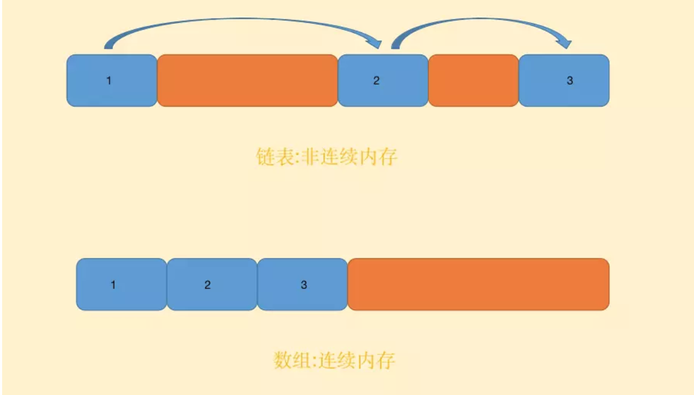

# 链表 linkedlist

### 什么是链表

> 链表是一种常见的基础数据结构，是一种线性表，但是并不会按线性的顺序存储数据，而是在每一个节点里存到下一个节点的指针(Pointer).

### 链表
- 单向链表
- 双向链表
- 循环链表

### 单向链表

> 单向链表的节点通常由两个部分构成,一个是节点储存的值val,另一个就是节点的指针next.

#### 查找性能  (**链表的查找性能与数组一样,都是时间复杂度为O(n)**)

> 单向链表的查找操作通常是这样的:

- 从头节点进入,开始比对节点的值,如果不同则通过指针进入下一个节点
- 重复上面的动作,直到找到相同的值,或者节点的指针指向null

